# Siddhant Billing — Project Guide

> Complete reference for how this application is built, how data flows, and how each part works together.  
> **Stack:** React 19 frontend + Node.js/Express API + MongoDB Atlas.

---

## Table of Contents

1. [What This Project Does](#1-what-this-project-does)
2. [Repository Layout](#2-repository-layout)
3. [High-Level Architecture](#3-high-level-architecture)
4. [Runtime Flow (End-to-End)](#4-runtime-flow-end-to-end)
5. [Authentication Flow](#5-authentication-flow)
6. [Frontend Deep Dive](#6-frontend-deep-dive)
7. [Backend Deep Dive](#7-backend-deep-dive)
8. [Database & Data Models](#8-database--data-models)
9. [Business Modules](#9-business-modules)
10. [Invoice & Line-Item Math](#10-invoice--line-item-math)
11. [API Reference Summary](#11-api-reference-summary)
12. [Environment & Configuration](#12-environment--configuration)
13. [Local Development](#13-local-development)
14. [Seed Data & Demo Login](#14-seed-data--demo-login)

---

## 1. What This Project Does

**Siddhant Billing** is a web application for a **truck/fleet maintenance and billing business** in India. It lets you:

| Module | Purpose |
|--------|---------|
| **Customers** | Manage fleet clients (GSTIN, PAN, credit days, billing state) |
| **Products / Item Groups** | Services (oil change, brake repair) and parts (tyres, filters) |
| **Invoices** | Create, edit, issue, and cancel tax invoices with line items |
| **Work Orders** | Track on-site vehicle service jobs before invoicing |
| **Reports / Dashboard** | KPI cards and earnings charts |
| **Settings** | Company info and invoice defaults (stored in browser only) |

The UI is a single-page React app. All business data lives in **MongoDB** via the Node.js API.

---

## 2. Repository Layout

```
Siddhant/
├── frontend/          # React + Vite SPA (port 3000)
├── backend/           # Express + Mongoose API (port 8080)
├── docker-compose.yml # Optional local MongoDB (if you install Docker)
└── PROJECT_GUIDE.md   # This file
```

### Frontend (`frontend/`)

```
src/
├── main.tsx                 # App bootstrap; optionally starts MSW mocks
├── App.tsx                  # Routes + providers
├── features/                # One folder per business domain
│   ├── auth/
│   ├── dashboard/
│   ├── customers/
│   ├── invoices/
│   ├── item-groups/         # Products UI (named "Item Groups" in nav)
│   ├── work-orders/
│   ├── reports/
│   └── settings/
├── shared/
│   ├── components/          # Layout, UI primitives, widgets (DataTable, etc.)
│   ├── types/
│   └── utils/
├── infrastructure/
│   └── http/
│       ├── apiClient.ts     # Axios + JWT interceptor
│       └── queryClient.ts   # React Query defaults
└── test/mocks/              # MSW handlers for offline demo / tests
```

### Backend (`backend/`)

```
src/
├── index.ts                 # Startup: DB → seed → listen
├── app.ts                   # Express app factory
├── config/env.ts            # Environment variables
├── db/connect.ts            # Mongoose connection
├── middleware/
│   ├── auth.ts              # JWT verify + sign
│   ├── correlationId.ts     # Request tracing header
│   └── errorHandler.ts      # Global error JSON
├── models/                  # Mongoose schemas
├── routes/                  # REST endpoints
├── seed/                    # Demo data loader
└── utils/                   # Pagination, calc, API envelope
```

---

## 3. High-Level Architecture

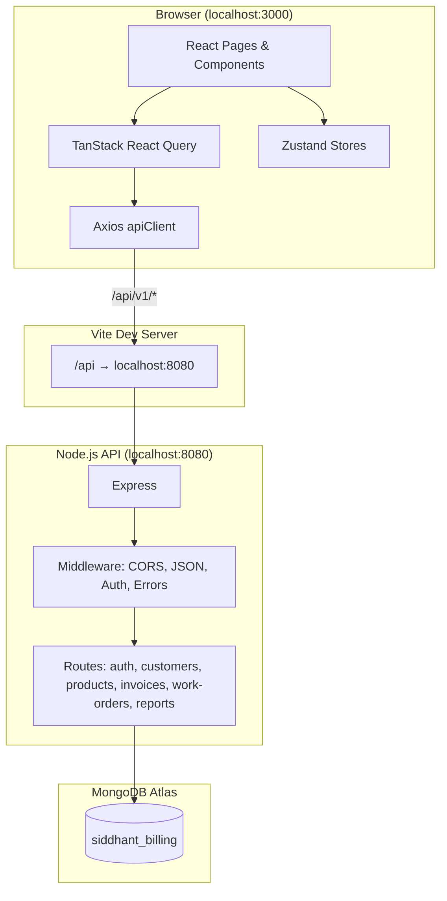

### Layer responsibilities

| Layer | Technology | Responsibility |
|-------|------------|----------------|
| **Presentation** | React 19, Tailwind-style UI | Screens, forms, tables, charts |
| **Client state** | Zustand + localStorage | Auth profile, app settings |
| **Server state** | TanStack React Query | Cache API lists/details; mutations |
| **HTTP** | Axios | Attach JWT; unwrap `{ data }` envelope |
| **API** | Express 4 | REST, validation, business rules |
| **Persistence** | Mongoose 8 | MongoDB documents |
| **Auth** | JWT + bcrypt + refresh tokens | Login, protected routes |

---

## 4. Runtime Flow (End-to-End)

### Example: User opens the Invoices list

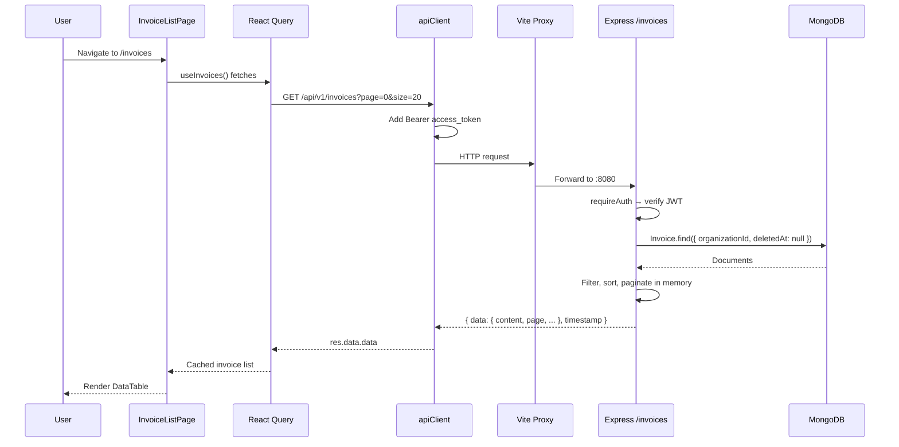

### Example: User creates a customer

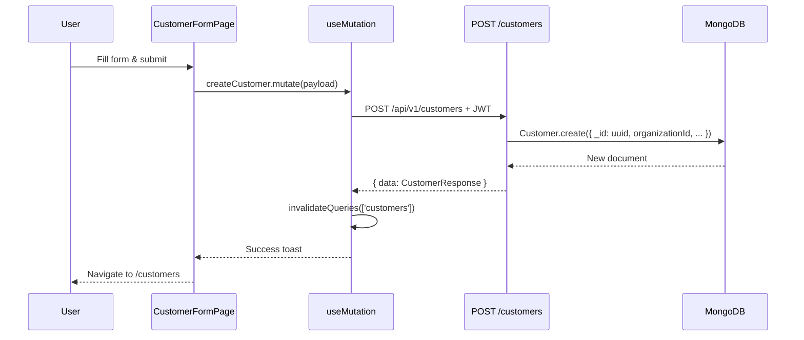

---

## 5. Authentication Flow

### Login sequence

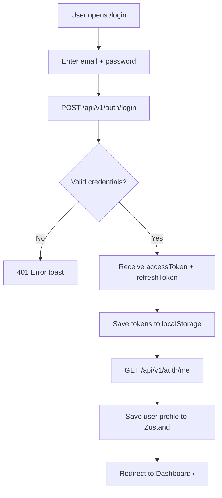

### Token storage

| Storage | Key / Location | Contents |
|---------|----------------|----------|
| `localStorage` | `access_token` | JWT (15 min default) |
| `localStorage` | `refresh_token` | Opaque UUID (7 days) |
| `localStorage` (persist) | `siddhant-logistics-auth` | User profile object |

### Protected routes

```
Every app route except /login is wrapped in:
  ProtectedRoute → checks localStorage access_token
    └── AppLayout (Sidebar + Header)
          └── Page component
```

If any API call returns **401**, the Axios interceptor clears tokens and redirects to `/login`.

### Backend auth internals

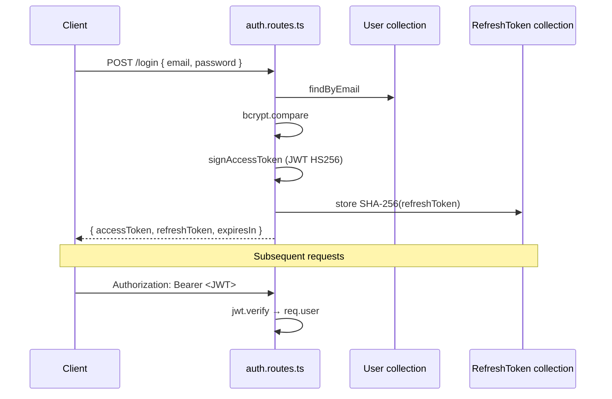

**JWT payload includes:** `sub` (user id), `email`, `organizationId`, `tenantId`, `roles`, `permissions`, `fullName`.

**Refresh flow:** `POST /auth/refresh` revokes the old refresh token and issues a new pair. The frontend has this API wired but does **not** auto-refresh on 401 yet.

---

## 6. Frontend Deep Dive

### Routing map

| URL | Page | Description |
|-----|------|-------------|
| `/login` | LoginPage | Public login form |
| `/` | DashboardPage | Overview widgets + charts |
| `/invoices` | InvoiceListPage | Paginated invoice table |
| `/invoices/new` | InvoiceDetailPage | Create invoice |
| `/invoices/:id` | InvoiceDetailPage | View/edit invoice |
| `/customers` | CustomerListPage | Customer table |
| `/customers/new` | CustomerFormPage | Create customer |
| `/customers/:id/edit` | CustomerFormPage | Edit customer |
| `/item-groups` | ItemGroupsPage | Product/service catalog |
| `/item-groups/new` | ProductFormPage | Create product |
| `/item-groups/:id/edit` | ProductFormPage | Edit product |
| `/work-orders` | WorkOrdersPage | Work order list |
| `/work-orders/new` | WorkOrderFormPage | Create work order |
| `/work-orders/:id` | WorkOrderFormPage | View/edit work order |
| `/reports` | ReportPage | Reports & analytics |
| `/settings` | SettingsPage | Local company settings |

### Feature module pattern

Each feature follows the same structure:

```
features/<name>/
  api/<name>.api.ts    → thin Axios functions
  hooks/use<Name>.ts   → useQuery / useMutation
  queryKeys.ts         → React Query cache keys
  types/*.types.ts     → TypeScript interfaces
  pages/*.tsx          → UI screens
```

### State management split

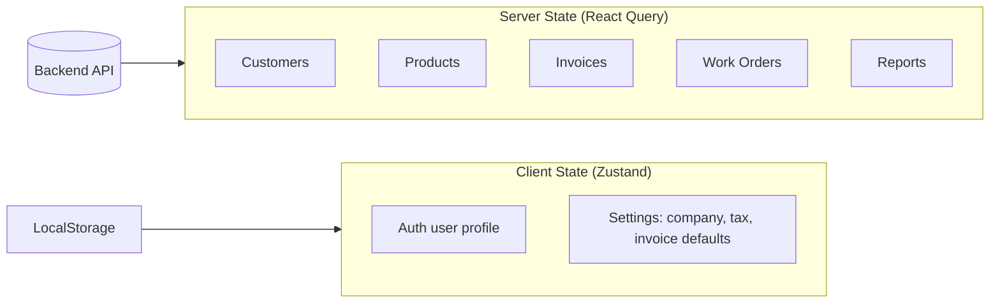

- **React Query** handles all data from the API (caching, refetch, mutations).
- **Zustand** handles auth profile and settings (persisted to `localStorage`).

### API client

```typescript
// Base URL: /api/v1 (proxied to backend in dev)
// Request:  attaches Authorization: Bearer <access_token>
// Response: pages use res.data.data
// 401:      clears tokens → redirect /login
```

### MSW vs real API

| Mode | Env variable | Behavior |
|------|--------------|----------|
| **Real API** (current) | `VITE_MOCK_API=false` | Requests hit backend via Vite proxy |
| **Mock demo** | `VITE_MOCK_API=true` | Service worker intercepts with in-memory data |
| **Dev bypass** | `VITE_DEV_BYPASS_AUTH=true` | Skip login with fake token |

### Vite proxy

```
Browser  →  http://localhost:3000/api/v1/invoices
Vite     →  http://localhost:8080/api/v1/invoices
```

---

## 7. Backend Deep Dive

### Startup sequence

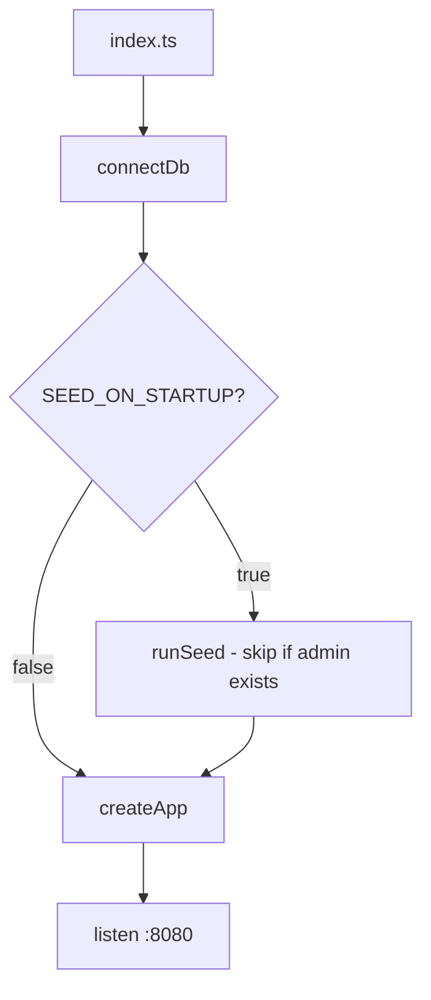

### Middleware chain (every request)

```
1. cors          → allow localhost:3000
2. express.json  → parse JSON body (max 2MB)
3. correlationId → x-correlation-id header
4. /api/v1/*     → route handlers
5. errorHandler  → { message } JSON errors
```

### Multi-tenancy

Every business document has `organizationId`. The JWT carries the user's org id; all queries filter:

```javascript
{ organizationId: req.user.organizationId, deletedAt: null }
```

Currently one org is seeded: `demo-org`.

### Soft delete

`DELETE` endpoints set `deletedAt = now()` instead of removing documents. Unique indexes (customer `code`, product `sku`, etc.) ignore soft-deleted rows.

### API response envelope

**Success:**
```json
{
  "data": { ... },
  "timestamp": "2026-06-25T18:50:12.170Z"
}
```

**Paginated list (`data` shape):**
```json
{
  "content": [ ... ],
  "page": 0,
  "size": 20,
  "totalElements": 8,
  "totalPages": 1,
  "last": true
}
```

**Error:**
```json
{ "message": "Not found" }
```

---

## 8. Database & Data Models

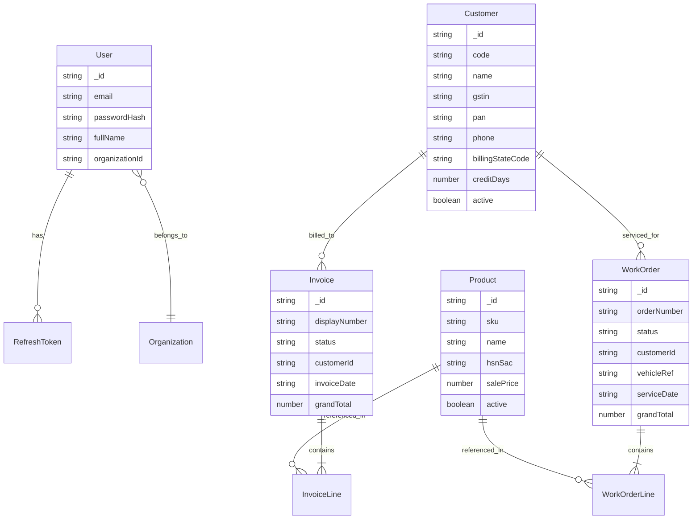

### Invoice statuses

| Status | Meaning |
|--------|---------|
| `DRAFT` | Being prepared, not finalized |
| `ISSUED` | Sent to customer |
| `CANCELLED` | Voided |

### Work order statuses

| Status | Meaning |
|--------|---------|
| `OPEN` | New job |
| `IN_PROGRESS` | Work underway |
| `COMPLETED` | Service done |
| `INVOICED` | Billed via invoice |
| `CANCELLED` | Job cancelled |

---

## 9. Business Modules

### Module interaction diagram

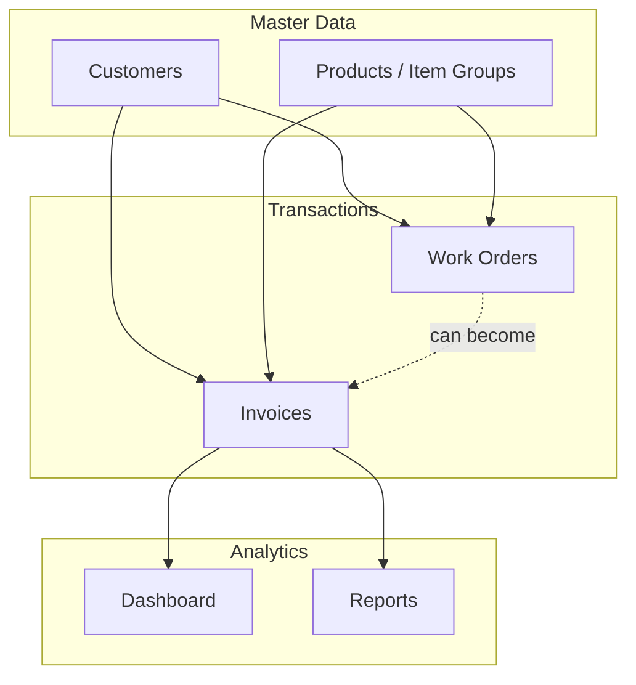

### Customers

**Flow:** List → Create/Edit form → `POST` or `PUT /customers` → MongoDB.

**Key fields:** `code` (unique), `name`, `gstin`, `pan`, `phone`, `billingStateCode` (GST state, e.g. `27` = Maharashtra), `creditDays`, `active`, `notes`.

### Products (Item Groups)

**Flow:** Catalog list → form → `POST` or `PUT /products`.

**Key fields:** `sku`, `name`, `description`, `hsnSac`, `salePrice`, `active`.

### Invoices

**Flow:**

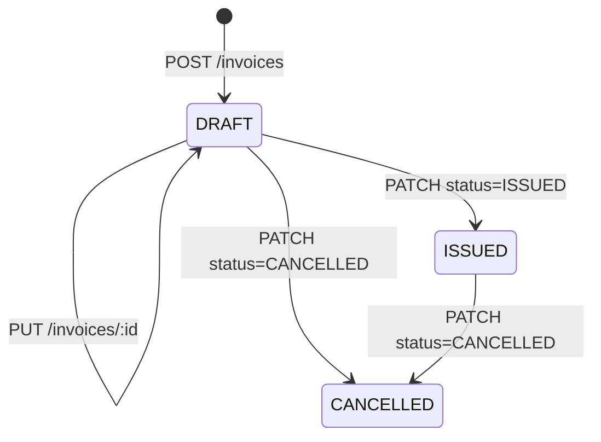

1. User picks customer and adds line items (product, qty, price, tax %, discount %).
2. Backend calculates `lineTotal` and `grandTotal`.
3. Auto-number: `SL-2026-001`, `SL-2026-002`, …

### Work Orders

Similar to invoices but for **on-site vehicle service**:

1. `POST /work-orders` → status `OPEN`, auto-number `WO-2026-001`.
2. Track `vehicleRef` (e.g. `MH-12-AB-1234`).
3. Status progresses: OPEN → IN_PROGRESS → COMPLETED → INVOICED.

### Reports / Dashboard

- `GET /reports/dashboard?fromDate&toDate` → invoice counts + grand total.
- Dashboard page also fires 5 parallel year queries for the earnings chart.
- Stats come from seeded `YEARLY_STATS` (not live DB aggregation yet).

### Settings

**No backend API.** Stored only in browser via Zustand (`siddhant-logistics-settings`): company name, address, default tax rate, invoice footer text.

---

## 10. Invoice & Line-Item Math

Every line item uses the same formula on frontend (MSW) and backend:

```
lineTotal = quantity × unitPrice × (1 + taxPercent/100) × (1 - discountPercent/100)
grandTotal = sum of all lineTotals (rounded to 2 decimals)
```

**Example:** 4 × ₹2,500 × 1.18 × 1.0 = **₹11,800**

Tax is applied as a **multiplier** on the line (GST-inclusive style in the formula). Discount reduces the total when `discountPercent > 0`.

---

## 11. API Reference Summary

Base URL: `http://localhost:8080/api/v1` (or `/api/v1` via proxy)

### Auth
| Method | Path | Auth | Body |
|--------|------|------|------|
| POST | `/auth/login` | No | `{ email, password }` |
| GET | `/auth/me` | Yes | — |
| POST | `/auth/refresh` | No | `{ refreshToken }` |
| POST | `/auth/logout` | Yes | `{ refreshToken? }` |

### CRUD resources (all require JWT)

| Resource | List | Get | Create | Update | Delete | Extra |
|----------|------|-----|--------|--------|--------|-------|
| Customers | GET `/customers` | GET `/:id` | POST | PUT | DELETE | — |
| Products | GET `/products` | GET `/:id` | POST | PUT | DELETE | — |
| Invoices | GET `/invoices` | GET `/:id` | POST | PUT | DELETE | PATCH `/:id/status` |
| Work Orders | GET `/work-orders` | GET `/:id` | POST | PUT | DELETE | PATCH `/:id/status` |

### Reports
| Method | Path | Query params |
|--------|------|--------------|
| GET | `/reports/dashboard` | `fromDate`, `toDate` |
| GET | `/reports/yearly-trend` | — (returns `[]`) |

### Health
| Method | Path |
|--------|------|
| GET | `/actuator/health` |

---

## 12. Environment & Configuration

### Backend (`backend/.env`)

| Variable | Purpose | Example |
|----------|---------|---------|
| `PORT` | API port | `8080` |
| `MONGODB_URI` | Atlas connection string | `mongodb+srv://.../siddhant_billing` |
| `JWT_SECRET` | Sign access tokens | 32+ char secret |
| `JWT_ACCESS_EXPIRES_IN` | Token TTL | `15m` |
| `JWT_REFRESH_EXPIRES_DAYS` | Refresh token life | `7` |
| `CORS_ORIGINS` | Allowed frontend origins | `http://localhost:3000` |
| `SEED_ON_STARTUP` | Auto-load demo data | `true` |

> **Never commit `backend/.env`** — use `backend/.env.example` as a template.

### Frontend (`frontend/.env.development`)

| Variable | Purpose | Current |
|----------|---------|---------|
| `VITE_MOCK_API` | Use MSW instead of real API | `false` |
| `VITE_DEV_BYPASS_AUTH` | Skip login in dev | `false` |
| `VITE_API_BASE_URL` | Override API base (optional) | defaults to `/api/v1` |

---

## 13. Local Development

### Prerequisites

- Node.js 20+
- MongoDB Atlas cluster (or local MongoDB on port 27017)

### Start both servers

```powershell
# Terminal 1 — API
cd backend
npm install
npm run dev
# → http://localhost:8080

# Terminal 2 — Frontend
cd frontend
npm install
npm run dev
# → http://localhost:3000
```

### Verify

| Check | URL |
|-------|-----|
| API health | http://localhost:8080/actuator/health |
| App | http://localhost:3000 |
| Login | `admin@siddhant.local` / `Admin@123` |

### Useful commands

| Command | Where | Purpose |
|---------|-------|---------|
| `npm run dev` | backend | Hot-reload API |
| `npm run seed` | backend | Manually seed DB |
| `npm run build` | both | Production build |
| `npm test` | frontend | Vitest unit tests |
| `npm run test:e2e` | frontend | Playwright E2E |

---

## 14. Seed Data & Demo Login

On first startup (when no admin user exists), the backend seeds:

| Entity | Count | Examples |
|--------|-------|----------|
| Users | 1 | `admin@siddhant.local` |
| Customers | 8 | Maruti Transport, Tata Fleet, … |
| Products | 15 | Engine Oil Change, Truck Tyre 10R20, … |
| Invoices | 12 | SL-2026-001 … SL-2026-012 |
| Work Orders | 10 | WO-2026-001 … WO-2026-010 |

**Organization:** `demo-org`  
**Password:** `Admin@123`

Seed is **idempotent** — if the admin user already exists, seeding is skipped.

---

## Quick Reference Diagram

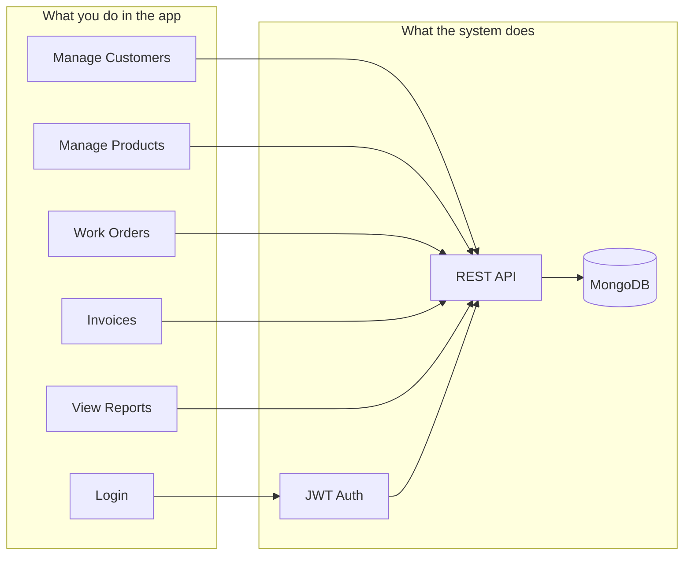

---

*Last updated: June 2026 — reflects Node.js backend + MongoDB Atlas setup.*
