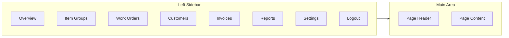
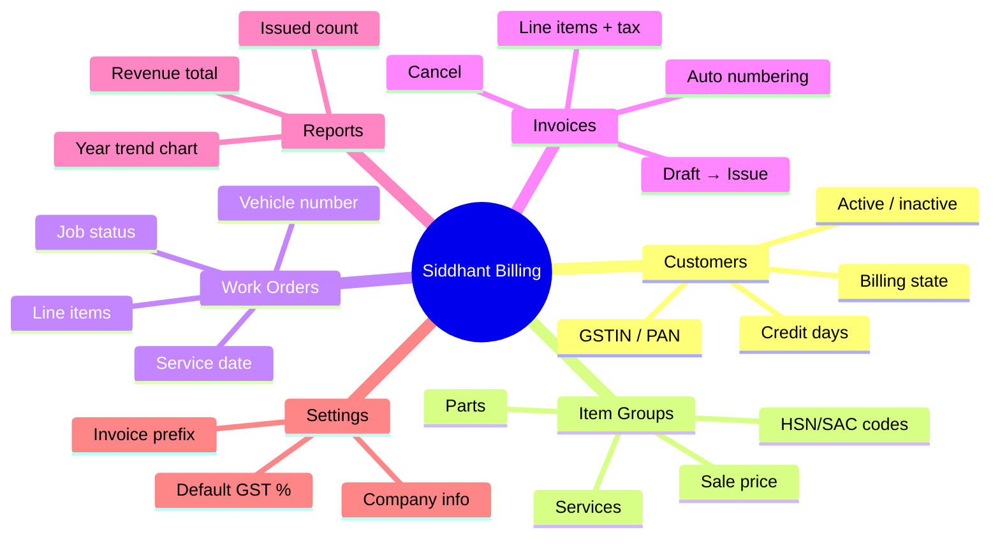
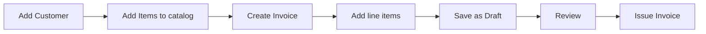
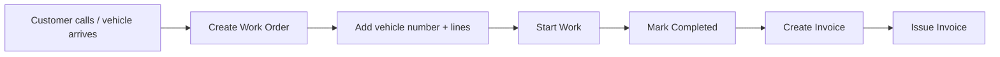
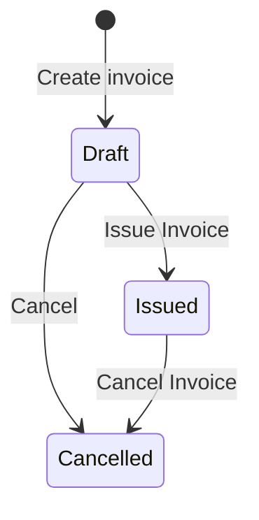
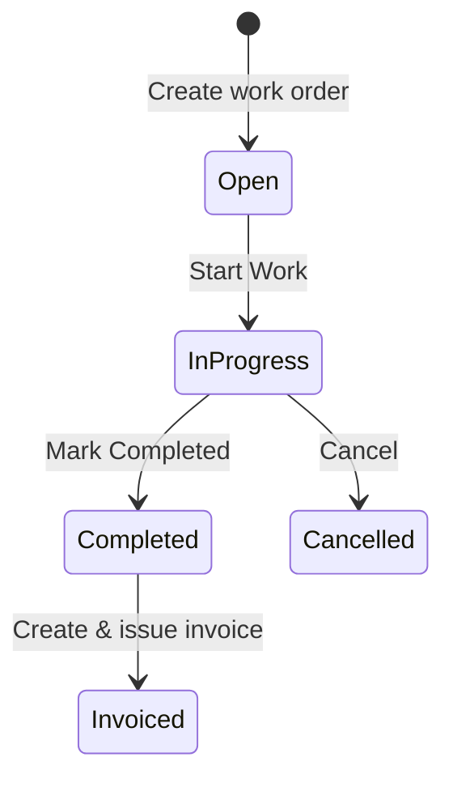

# Siddhant Logistics — User Guide

> How to use the **Billing Suite** web application.  
> This guide is written for **business users** — owners, accountants, and workshop staff who manage customers, services, invoices, and work orders.

---

## Table of Contents

1. [What Is This App?](#1-what-is-this-app)
2. [Who Should Use It?](#2-who-should-use-it)
3. [Getting Started](#3-getting-started)
4. [App Layout & Navigation](#4-app-layout--navigation)
5. [Feature Overview](#5-feature-overview)
6. [How to Use Each Module](#6-how-to-use-each-module)
7. [Common Workflows](#7-common-workflows)
8. [Invoice & Work Order Statuses](#8-invoice--work-order-statuses)
9. [Quick Search (⌘K)](#9-quick-search-k)
10. [Settings](#10-settings)
11. [Tips & Shortcuts](#11-tips--shortcuts)

---

## 1. What Is This App?

**Siddhant Logistics Billing Suite** is a web-based business application for **fleet and truck maintenance workshops** that also bill their clients.

With this app you can:

- Keep a **customer directory** (transport companies, fleet operators)
- Maintain a **catalog of services and parts** (oil changes, brake pads, tyres, etc.)
- Record **work orders** when a vehicle comes in for service
- Create and manage **tax invoices** with GST-ready line items
- View **reports and dashboard** summaries of your billing activity

Everything is accessed through a browser — no software to install on your computer (except a modern web browser like Chrome or Edge).

---

## 2. Who Should Use It?

| Role | Typical use |
|------|-------------|
| **Business owner / manager** | Dashboard, reports, customer overview |
| **Accounts / billing staff** | Invoices, customer credit terms, GST details |
| **Workshop supervisor** | Work orders, vehicle references, job status |
| **Admin** | Item catalog, company settings, user login |

Each user signs in with their own **email and password**. What they can do depends on permissions assigned by your administrator.

---

## 3. Getting Started

### Step 1 — Open the app

Your administrator will give you a URL (for local development this is usually **http://localhost:3000**).

### Step 2 — Sign in

1. You will see the **login screen** with the Siddhant Logistics branding.
2. Enter your **email address** and **password**.
3. Click **Sign in**.

If credentials are wrong, you will see an error message. Contact your admin to reset access.

**Demo credentials** (if using the seeded demo environment):

| Field | Value |
|-------|-------|
| Email | `admin@siddhant.local` |
| Password | `Admin@123` |

### Step 3 — You land on the Overview

After a successful login, you are taken to the **Overview** (dashboard) — your home screen with key numbers and recent activity.

### Step 4 — Sign out when done

Click **Logout** at the bottom of the left sidebar. Always log out on shared computers.

---

## 4. App Layout & Navigation



### Left sidebar menu

| Menu item | What it is |
|-----------|------------|
| **Overview** | Home dashboard with KPIs, charts, recent invoices |
| **Item Groups** | Your product & service catalog (parts, labour, services) |
| **Work Orders** | On-site vehicle jobs and repair tracking |
| **Customers** | Client companies you bill |
| **Invoices** | Tax invoices — draft, issue, cancel |
| **Reports** | Detailed invoice statistics and 5-year trend chart |
| **Settings** | Company profile, invoice defaults, tax rate (saved in your browser) |

### Top area

Each page shows a **title** and short description in the header area so you always know where you are.

### Your profile

At the bottom of the sidebar you see your **name** and **email**. This confirms which account you are logged in as.

---

## 5. Feature Overview



### Feature summary table

| Feature | What you can do |
|---------|-----------------|
| **Overview** | See issued/draft/cancelled counts, revenue, recent invoices, earnings chart, mini calendar |
| **Customers** | Add, edit, search, deactivate customers; store GSTIN, PAN, phone, credit terms |
| **Item Groups** | Add services (e.g. Oil Change) and parts (e.g. Truck Tyre); set SKU, price, HSN/SAC |
| **Work Orders** | Log a job for a customer + vehicle; add line items; track status from Open to Completed |
| **Invoices** | Build invoices with multiple lines; issue to customer; cancel if needed |
| **Reports** | View invoice KPIs and a 5-year bar chart (issued / draft / cancelled) |
| **Settings** | Configure your company details and invoice/tax preferences |
| **Quick Search** | Press `Ctrl+K` (or `⌘K` on Mac) to jump anywhere or find invoices/customers |

---

## 6. How to Use Each Module

### 6.1 Overview (Dashboard)

**Purpose:** Quick snapshot of how the business is doing.

**What you see:**

| Widget | Information |
|--------|-------------|
| **KPI cards** | Issued invoices, drafts, cancelled, revenue |
| **Summary panel** | Shortcuts to other sections |
| **Earnings chart** | Revenue trend over recent years |
| **Mini calendar** | Date reference |
| **Recent invoices** | Latest invoices with status badges |
| **Percentage chart** | Breakdown of invoice statuses |

**How to use:** Open the app — this is the default home page. No action needed; use it to monitor daily activity.

---

### 6.2 Customers

**Purpose:** Store every client company you work with.

#### View all customers

1. Click **Customers** in the sidebar.
2. Browse the table — columns include code, name, phone, credit days, status.
3. Use the **search box** to find by name or customer code.
4. Filter by **active / inactive** if available.

#### Add a new customer

1. Click **Customers** → **New Customer** (or **+ Add** button).
2. Fill in the form across tabs:

| Tab | Fields |
|-----|--------|
| **Basic Info** | Customer code, company name |
| **Billing** | GSTIN, PAN, billing state code (2-digit, e.g. `27` for Maharashtra) |
| **Other** | Email, phone, credit days (payment terms), notes, active toggle |

3. Click **Save**.

**Tips:**
- **Customer code** must be unique (letters, numbers, `_`, `-` only) — e.g. `MARUTRANS`.
- **Credit days** = how many days the customer has to pay (e.g. 30, 45, 60).
- **Billing state code** matters for GST — same state = CGST+SGST, different state = IGST.

#### Edit or delete a customer

1. Click a row or **Edit** on an existing customer.
2. Update fields and **Save**.
3. To remove: use **Delete** (customer is hidden from lists but kept in the system for records).

---

### 6.3 Item Groups (Products & Services)

**Purpose:** Your price list — everything you sell on invoices and work orders.

#### View catalog

1. Click **Item Groups** in the sidebar.
2. See all items with SKU, name, sale price, and active status.
3. Search by name or SKU.

#### Add a new item

1. Click **New Product** / **Add**.
2. Enter:

| Field | Example | Notes |
|-------|---------|-------|
| **SKU** | `SVC-OIL` | Unique product code |
| **Name** | Engine Oil Change | Display name on invoices |
| **Description** | Drain and refill 15W-40 | Optional details |
| **HSN/SAC** | `998814` | GST classification code |
| **Sale price** | `2500` | Base price in ₹ (before tax line calc) |
| **Active** | On/Off | Inactive items can be hidden from new documents |

3. Click **Save**.

**Typical items in a fleet workshop:**

- **Services:** Oil change, brake inspection, tyre fitting, engine tune-up, welding
- **Parts:** Brake pads, truck tyres, engine oil drums, air filters

---

### 6.4 Work Orders

**Purpose:** Track a **vehicle service job** from arrival to completion — before or alongside invoicing.

#### View work orders

1. Click **Work Orders**.
2. Use tabs to filter: **All**, **Open**, **In Progress**, **Completed**, **Invoiced**, **Cancelled**.
3. Search by order number, customer name, or vehicle number.

#### Create a work order

1. Click **New Work Order**.
2. Select **Customer**.
3. Enter **Vehicle reference** (e.g. `MH-12-AB-1234` — registration number).
4. Set **Service date**.
5. Add a **description** of the job (optional).
6. Add **line items** — pick products from catalog or type descriptions manually:

| Per line | What to enter |
|----------|---------------|
| Product | Optional — pulls from Item Groups |
| Description | What was done or supplied |
| Quantity | How many |
| Unit price | Price per unit in ₹ |
| Tax % | GST rate (e.g. 18) |
| Discount % | Optional discount |

7. The system calculates **line total** and **grand total** automatically.
8. Click **Save** — order starts as **Open**.

#### Update job status

On an existing work order, use action buttons:

| Current status | Available actions |
|----------------|-------------------|
| **Open** | Start Work → moves to **In Progress** |
| **In Progress** | Mark Completed, or Cancel |
| **Completed** | (Ready for invoicing) |
| **Invoiced** | Read-only — already billed |
| **Cancelled** | Read-only |

**Delete:** Only possible for **Open** or **Cancelled** orders.

---

### 6.5 Invoices

**Purpose:** Official **billing documents** sent to customers with tax breakdown.

#### View invoices

1. Click **Invoices**.
2. Filter tabs: **All**, **Issued**, **Draft**, **Cancelled**.
3. Search by invoice number or customer name.

#### Create an invoice

1. Click **New Invoice**.
2. Select **Customer** — customer name fills automatically.
3. Set **Invoice date** and **Due date** (based on customer credit days).
4. Add **line items** (same fields as work orders: product, qty, price, tax %, discount %).
5. Add **notes** if needed (e.g. "Scheduled Jan maintenance — 4 trucks").
6. Click **Save** — invoice is saved as **Draft**.

Invoice numbers are assigned automatically (e.g. `SL-2026-001`, `SL-2026-002`).

#### Issue an invoice

1. Open a **Draft** invoice.
2. Review all lines and totals.
3. Click **Issue Invoice** — status becomes **Issued**.

> **Important:** Once issued, the invoice becomes **read-only**. You cannot edit line items after issuing.

#### Cancel an invoice

1. Open an **Issued** (or Draft) invoice.
2. Click **Cancel Invoice**.
3. Status becomes **Cancelled** — kept for records but no longer active.

#### Delete an invoice

Only **Draft** invoices can be deleted from the list actions.

---

### 6.6 Reports

**Purpose:** Deeper view of billing performance than the Overview.

1. Click **Reports**.
2. View four KPI cards:
   - Issued invoice count
   - Draft invoice count
   - Cancelled invoice count
   - **Issued revenue** (total ₹)
3. Scroll to the **5-Year Invoice Trend** bar chart showing issued, draft, and cancelled counts per year.

Use this page for monthly reviews, year-end summaries, or sharing numbers with management.

---

### 6.7 Settings

**Purpose:** Configure how **your company** appears and default billing preferences.

> Settings are saved in **your browser** on this computer. They do not sync to other users unless you configure them on each device.

Open **Settings** from the sidebar. Four tabs:

| Tab | What you configure |
|-----|---------------------|
| **Company** | Business name, GSTIN, PAN, address, city, state code, phone, email |
| **Invoice** | Invoice number prefix, starting number, default due days, payment terms text |
| **Tax** | Default GST rate (0%, 5%, 12%, 18%, 28%) |
| **Profile** | View your logged-in name and email (read-only) |

Click **Save** on each tab after making changes.

---

## 7. Common Workflows

### Workflow A — New customer, first invoice



1. **Customers** → New → save client details with GSTIN.
2. **Item Groups** → ensure services/parts exist with correct prices.
3. **Invoices** → New → pick customer → add lines → Save.
4. Review totals → **Issue Invoice**.

---

### Workflow B — Vehicle comes in for service



1. **Work Orders** → New → customer + vehicle ref + job lines.
2. **Start Work** when mechanic begins.
3. **Mark Completed** when done.
4. **Invoices** → New → same customer and lines → **Issue**.

---

### Workflow C — Monthly review

1. Open **Overview** for quick KPIs.
2. Open **Reports** for detailed counts and 5-year chart.
3. **Invoices** → filter **Draft** → follow up on pending bills.
4. **Customers** → check inactive accounts.

---

## 8. Invoice & Work Order Statuses

### Invoice statuses

| Status | Color / meaning | What you can do |
|--------|-----------------|-----------------|
| **Draft** | Being prepared | Edit, issue, or delete |
| **Issued** | Sent to customer | View only; can cancel |
| **Cancelled** | Voided | View only |



### Work order statuses

| Status | Meaning |
|--------|---------|
| **Open** | Job logged, not started |
| **In Progress** | Work is underway |
| **Completed** | Service finished |
| **Invoiced** | Billed via invoice |
| **Cancelled** | Job cancelled |



---

## 9. Quick Search (⌘K)

Press **`Ctrl + K`** (Windows) or **`⌘ + K`** (Mac) anywhere in the app to open **Quick Search**.

You can:

- **Navigate** to any section (Overview, Invoices, Customers, etc.)
- **Jump to actions** — New Invoice, New Customer, New Product, New Work Order
- **Search live data** — type a customer name or invoice number to open it directly

Use arrow keys to move, **Enter** to open, **Esc** to close.

---

## 10. Settings

See [Section 6.7](#67-settings) above.

**Recommended first-time setup:**

1. **Settings → Company** — enter your workshop name, GSTIN, and address (appears on future invoice exports/prints when that feature is added).
2. **Settings → Invoice** — set your invoice prefix (e.g. `SL`) and default payment terms.
3. **Settings → Tax** — set default GST % (usually **18%** for services in India).

---

## 11. Tips & Shortcuts

| Tip | Detail |
|-----|--------|
| **Use customer codes** | Short unique codes (e.g. `TATAFLEET`) make search faster |
| **Keep Item Groups updated** | Correct prices and HSN/SAC codes save time on every invoice |
| **Draft first, issue later** | Save as Draft, double-check totals, then Issue |
| **Vehicle ref on work orders** | Always record registration number — essential for fleet clients |
| **Credit days per customer** | Set in customer profile; helps plan due dates on invoices |
| **Inactive customers** | Mark inactive instead of deleting — preserves invoice history |
| **Quick Search** | `Ctrl+K` / `⌘K` — fastest way to jump around |
| **Log out** | Always log out on shared PCs |

### Understanding line totals

Each invoice/work order line calculates:

```
Line total = Quantity × Unit price × (1 + Tax%) × (1 − Discount%)
Grand total = Sum of all line totals
```

**Example:** 4 oil changes at ₹2,500 + 18% GST = **₹11,800** per line (before any discount).

---

## At a Glance — All Features

| # | Feature | Access from sidebar | Main actions |
|---|---------|---------------------|--------------|
| 1 | Login / Logout | Login page / sidebar bottom | Sign in, sign out |
| 2 | Overview | Overview | View KPIs, charts, recent invoices |
| 3 | Customers | Customers | List, add, edit, delete, search |
| 4 | Item Groups | Item Groups | Manage services & parts catalog |
| 5 | Work Orders | Work Orders | Create jobs, track status, vehicle ref |
| 6 | Invoices | Invoices | Create, draft, issue, cancel |
| 7 | Reports | Reports | KPIs + 5-year trend chart |
| 8 | Settings | Settings | Company, invoice, tax, profile |
| 9 | Quick Search | `Ctrl+K` / `⌘K` | Navigate & find records fast |

---

## Need Help?

| Issue | What to do |
|-------|------------|
| Cannot log in | Check email/password; contact your administrator |
| Page shows empty data | Ensure you are connected; refresh the browser |
| Invoice won't edit | Issued invoices are read-only — cancel and create new if needed |
| Wrong totals | Check quantity, unit price, tax %, and discount % on each line |
| Settings not on another PC | Settings are per-browser — configure on each device |

---

*Siddhant Logistics Billing Suite — User Guide*  
*For technical setup and architecture, see `PROJECT_GUIDE.md`.*
